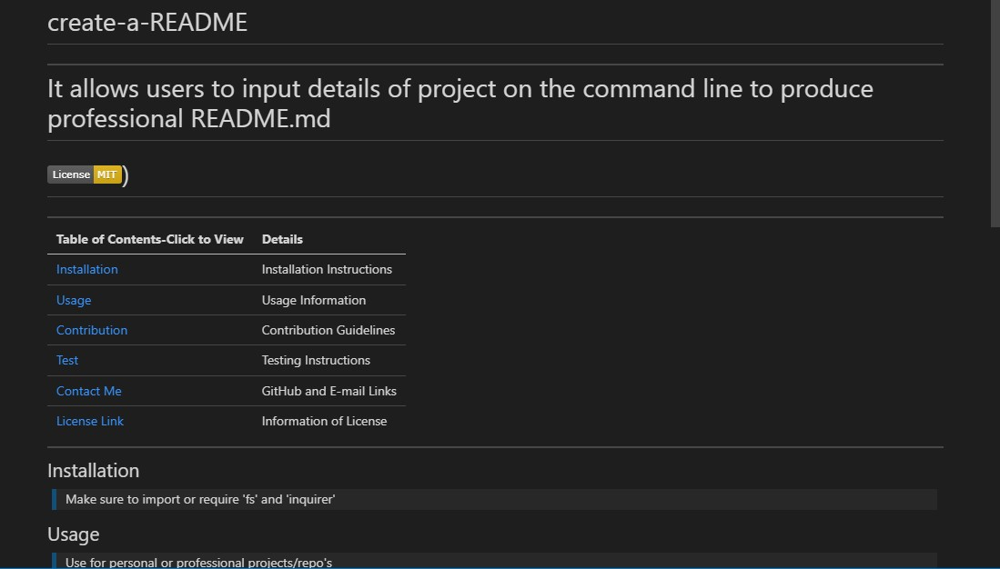

# create-a-README

## This is command-line application that accepts user input and, upon completion of the prompts, the user will have a professional README.md 

## I have provided video reference to view the application and a sampleREADME.md to view the the final product

> The sample includes a license, to show the full functionality
>  
> [View demo](https://watch.screencastify.com/v/OdQQDHeRTyr1IQZNU3p9)  

### This application utilized 'fs' and 'inquirer' in addition to 'requiring' and exporting modules in Javascript 
